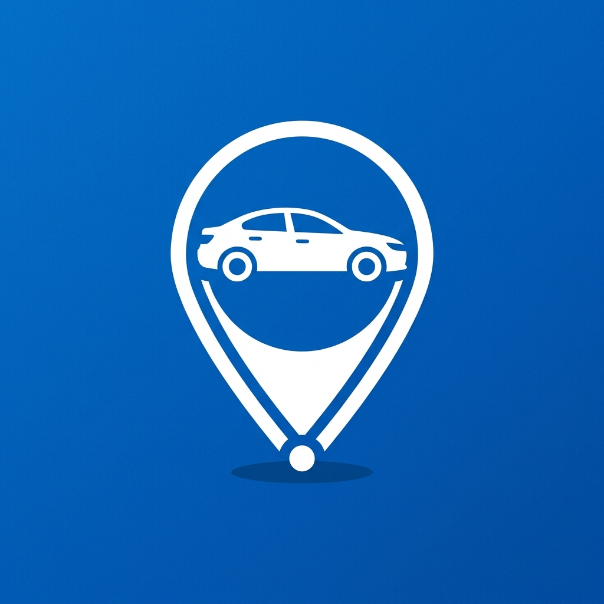

<p align="center">
  
</p>

<h1 align="center">Parked</h1>

<p align="center">
  A private, offline-first parking companion for saving a car's location, floor, spot and photo.<br />
  Aracınızın konumunu, katını, park yerini ve fotoğrafını kaydetmek için gizlilik odaklı çevrimdışı park yardımcısı.
</p>

<p align="center">
  <strong>Free · Account-free · Offline-first · English &amp; Turkish</strong><br />
  <strong>Ücretsiz · Hesapsız · Çevrimdışı · İngilizce &amp; Türkçe</strong>
</p>

<p align="center">
  <a href="https://github.com/koral29-prog/parked/raw/main/releases/Parked-v1.0.1-debug.apk">
    
  </a>
</p>

> The downloadable APK is a test build for direct installation. It is not a Play Store-signed production release.

## About

Parked helps you get back to your car without relying on an account, cloud sync, advertising, or a remote backend. Save your current location with GPS when available, then add a floor, section, parking bay, note, photo, and optional meter reminder. The current parking screen offers distance, direction, and a compass-style guide back to the saved spot.

Parked; hesap, bulut eşitleme, reklam veya uzaktaki bir sunucu olmadan aracınıza geri dönmenize yardımcı olur. GPS kullanılabilir olduğunda konumu kaydeder; kat, bölüm, park yeri, not, fotoğraf ve isteğe bağlı park süresi hatırlatıcısı ekleyebilirsiniz.

## Features

- Save GPS or indoor parking locations
- Floor, aisle, bay, landmark, note, and photo details
- Compass-style return guidance and external navigation shortcut
- Optional parking meter reminder
- Local parking history and one-tap clear action
- English and Turkish interface
- Light, dark, and system themes
- Local-only data storage with no account or cloud sync

## Privacy by design

- Parking records and photos stay on the device
- No account system, analytics, advertising, or cloud database
- Location permission is requested only when saving or guiding to a spot
- The app remains useful for indoor parking without GPS

## Run locally

Open the project in Android Studio, then run it on an Android device or emulator. The included Gradle wrapper can also build the debug APK:

```sh
./gradlew :app:assembleDebug
```

The APK is written to `releases/Parked-v1.0.1-debug.apk` for direct installation.

## Project structure

```text
app/src/main/java/com/example/data/       Local parking, location, and compass data
app/src/main/java/com/example/ui/         Compose screens, components, theme, and copy
app/src/main/java/com/example/viewmodel/  Parking session state and actions
app/src/main/res/                         Android resources and launcher assets
releases/                                 Downloadable APK builds
```
